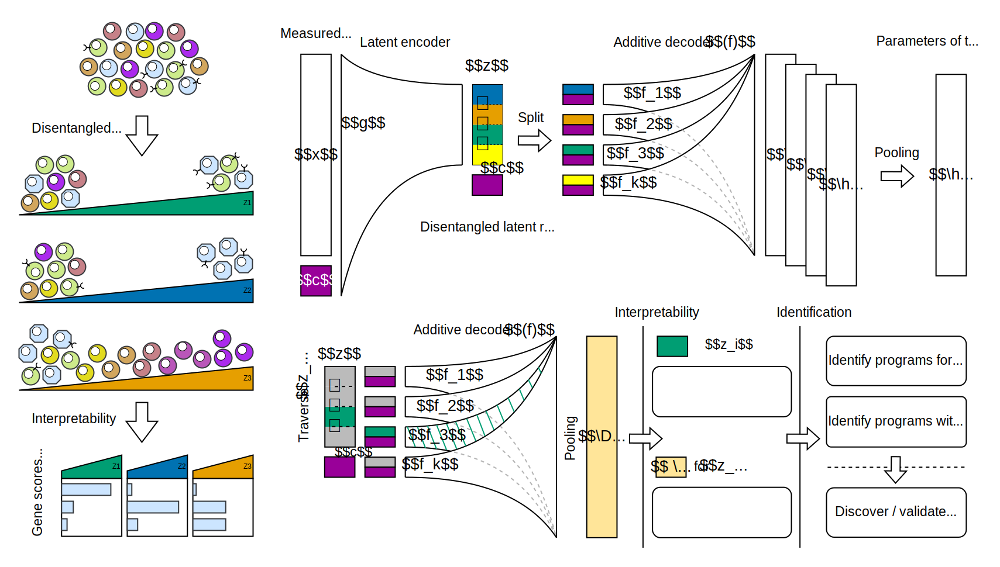

# DRVI

[![Tests][badge-tests]][link-tests]
[![Documentation][badge-docs]][link-docs]

[badge-tests]: https://img.shields.io/github/actions/workflow/status/theislab/drvi/test.yaml?branch=main
[link-tests]: https://github.com/theislab/drvi/actions/workflows/test.yml
[badge-docs]: https://img.shields.io/readthedocs/drvi

Unsupervised Deep Disentangled Representation of Single-Cell Omics

<h1 align="center">
    <picture>
        <source srcset=".github/misc/concept.svg">
        
    </picture>
</h1>

## Getting started

Please refer to the [documentation][link-docs]. In particular, the

-   [API documentation][link-api].
-   [Tutorials][link-tutorials]

## Installation

You need to have Python 3.10 or newer installed on your system. If you don't have
Python installed, we recommend installing [Mambaforge](https://github.com/conda-forge/miniforge#mambaforge).

There are several alternative options to install drvi:

<!--
1. Install the latest release of `drvi-py` from [PyPI][link-pypi]:

```bash
pip install drvi-py
```
-->

1. Install the latest development version:

```bash
pip install git+https://github.com/theislab/drvi.git@main
```

## Release notes

See the [changelog][changelog].

## Contact

[//]: # "TODO: make clear where to ask questions:"
[//]: # "For questions and help requests, you can reach out in the [scverse discourse][scverse-discourse]."

If you found a bug, please use the [issue tracker][issue-tracker].

## Citation

If DRVI is helpful in your research, please consider citing the following paper:

> t.b.a

[issue-tracker]: https://github.com/theislab/drvi/issues
[changelog]: https://drvi.readthedocs.io/latest/changelog.html
[link-docs]: https://drvi.readthedocs.io
[link-api]: https://drvi.readthedocs.io/latest/api.html
[link-tutorials]: https://drvi.readthedocs.io/latest/tutorials.html
[link-pypi]: https://pypi.org/project/drvi-py
